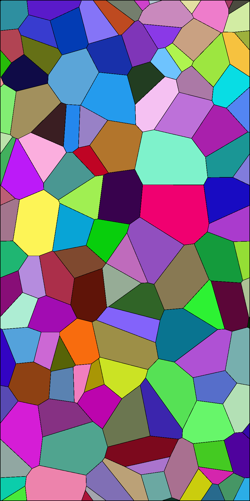
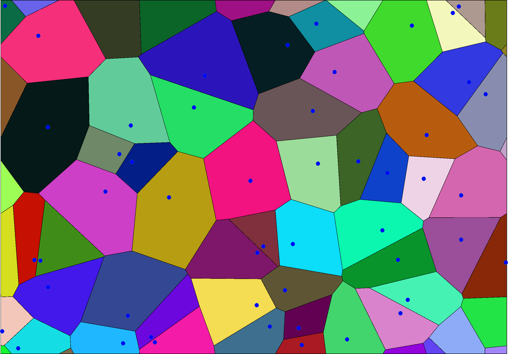

# periodicVoronoi
Cover a rectangular domain with periodic Voronoi cells


## Requirements

- [GPC](http://www.cs.man.ac.uk/~toby/gpc/) library

  Use this [MATLAB wrapper](https://fr.mathworks.com/matlabcentral/fileexchange/8818-polygon-clipper). It is assumed that the compiled mex file is called *PolygonClip*.

- at least MATLAB R2007a (because of input validation; the main routine uses `voronoin` introduced before R2006a)

The code would probably work in Octave as well, if one manages to compile GPC as an .oct file.


## Usage

### Syntax

The general syntax is

```matlab
[cells, seeds] = periodicVoronoi(domain, varargin)
```

where inputs are

- `domain` is a 4-by-1 or 1-by-4 vector in which the first two elements give the $x$ and $y$ coordinates of the bottom left corner of the rectangular region, the third element is the width, while the fourth element is the height of the rectangle. This input is compulsory.
- parameter-value pairs:
   - `'seeds', seedMatrix`, where `seedMatrix` is an N-by-2 matrix, each of its rows giving the $x$ and $y$ coordinates of a seed. If not given, the seeds are sampled from a uniformly random distribution on the `domain`.
   - `'nSeed', N`, where `N` is the number of cells to be generated. This option is disregarded if the seeds are given by the user (see the previous option). If not given, the default number of 10 cells are generated (unless the above option says else).

and the outputs are


- `cells` gives the generated Voronoi cells in an M-by-1 cell array, each cell in the cell array containing a matrix of two columns, the $x$ and $y$ coordinates of a bounded Voronoi cell
- `seeds` N-by-2 matrix, the $x$ and $y$ coordinates of the seeds


### Examples

1. Generate 100 cells and then plot them

   ``` matlab
   cells = periodicVoronoi([1 2 1 2], 'nSeed',100);
   for iCell = cells
       patch(iCell{:}(:,1), iCell{1}(:,2), rand(1,3));
   end
   axis('equal'); axis('off');
   ```
   We obtain the following image:

   

2. Show the seeds of the Voronoi diagram

   ``` matlab
   cells = periodicVoronoi([-1 4 5 3.5], 'nSeed',50);
   for iCell = cells
       patch(iCell{:}(:,1), iCell{1}(:,2), rand(1,3));
   end
   for iSeed = 1:size(seeds,1)
       line(seeds(iSeed,1), seeds(iSeed,2), 'Marker','o','MarkerFaceColor','blue');
   end
   axis('equal'); axis('off');
   ```

   We obtain the following image:




## Algorithm

The algorithm is taken from [1].


## Extensibility

By changing the lines

```matlab
voronoin(x)
```

to another kind of tessellator, other tessellations can be created. Also, one can use other methods for cutting the Voronoi cells with the original domain if GPC is not suitable (cannot compile it or its licensing is not appropriate).

---

## Reference

[1] DOI: 10.1007/s00466-008-0339-2,  https://link.springer.com/article/10.1007%2Fs00466-008-0339-2